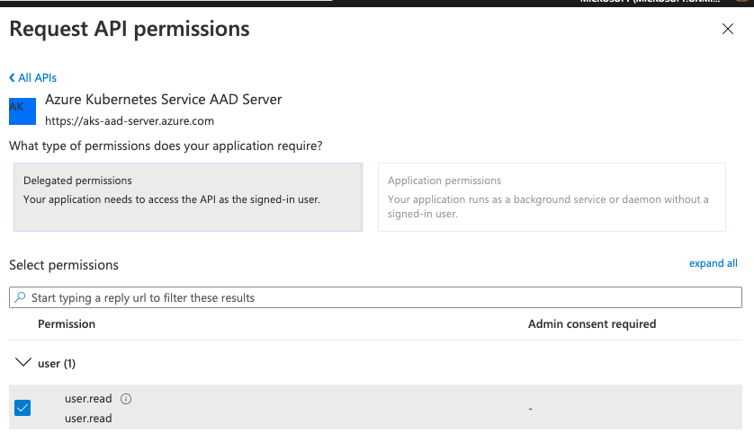

# A guide to enable oauth2 proxy to access Kubernetes dashboard on AKS managed AAD cluster

## Background

Kubernetes dashboard supports [Authorization header](https://github.com/kubernetes/dashboard/blob/master/docs/user/access-control/README.md#authorization-header) so that you can access the dashboard as the end user. On Azure Kubernetes Service (AKS) clusters with AAD enabled, you need [oauth2-proxy](https://github.com/oauth2-proxy/oauth2-proxy) to login the AAD user and send the bearer token to the dashboard.

Since AKS introduced [managed AAD](https://docs.microsoft.com/en-us/azure/aks/managed-aad), you no longer need to bring your own AAD applications. While this is great that you don't need to manage the AAD applications and the credential, it brings confusion on what you need to do to setup oauth2-proxy and the ingress.

**NOTE: AKS retires the Kubernetes dashboard from v1.18 and onwards. This guide assumes you are using the upstream Kubernetes dashboard.**

## Setup

In managed AAD, a pair of cross tenant AAD applications are provided. This can be seen in the kubeconfig. What this means is: kubectl uses a public client `80faf920-1908-4b52-b5ef-a8e7bedfc67a` to log you in to AAD to access an AAD resource `6dae42f8-4368-4678-94ff-3960e28e3630`. Once you complete the device code login, kubectl sends the access token, which is issued to access `6dae42f8-4368-4678-94ff-3960e28e3630`, to api-server. This is akin to how you use azure cli to access Azure. That, too, uses a public client application to request access token to Azure (https://management.azure.com/).

```yaml
    auth-provider:
      config:
        apiserver-id: 6dae42f8-4368-4678-94ff-3960e28e3630
        client-id: 80faf920-1908-4b52-b5ef-a8e7bedfc67a
        config-mode: '1'
        environment: AzurePublicCloud
        tenant-id: <your-aad-tenant-id>
      name: azure
```

To translate this into oauth2 proxy configuration, you need to create a AAD Web application to be used by the oauth2-proxy so that the token flow looks like: user logins to oauth2-proxy (web app) to request access to AKS AAD Server App and forward the access token to Kubernetes dashboard.

### Creating the web application

* In AAD > App Registration, create an application with redirect url like `https://<your-dns>/oauth2/callback`
* create a client secret under "Certificate & secrets"
* In "API Permissions" > "Add a permission" > "APIs my organization uses", put in `6dae42f8-4368-4678-94ff-3960e28e3630`, and select "Delegated Permissions" and "user.read".
  

  > Note:
  > It is the same application ID 6dae42f8-4368-4678-94ff-3960e28e3630 in all clouds.

### Configure oauth2-proxy

You will need to use `azure` provider and specify `--resource=6dae42f8-4368-4678-94ff-3960e28e3630`. This allows the oauth2-proxy, which uses the web app we just created, to request access to AKS AAD Server App. However, due to [#779](https://github.com/oauth2-proxy/oauth2-proxy/issues/779) and [#913](https://github.com/oauth2-proxy/oauth2-proxy/issues/913), azure provider in oauth2-proxy is broken when `--resource` is used. While we are waiting for [#914](https://github.com/oauth2-proxy/oauth2-proxy/pull/914) to be merged, you can use my pre-built docker image `docker.io/weinong/oauth2-proxy:v6.1.1-109-g49746b8` which has the fix.

A sample deployment yaml is provided [oauth2-proxy.yaml](oauth2-proxy.yaml).

Here is the snippet

```yaml
    spec:
      containers:
      - args:
        - --provider=azure
        - --email-domain=*
        - --http-address=0.0.0.0:4180
        - --azure-tenant=<your-AAD-tenant-id>
        - --client-id=<your-web-app-application-id>
        - --client-secret=<your-web-app-secret>
        - --cookie-secret=<cookie secret> # refer to https://oauth2-proxy.github.io/oauth2-proxy/docs/configuration/overview/
        - --pass-access-token=true
        - --resource=6dae42f8-4368-4678-94ff-3960e28e3630
        - --set-xauthrequest=true
        image: docker.io/weinong/oauth2-proxy:v6.1.1-109-g49746b8
        imagePullPolicy: Always
        name: oauth2-proxy
```

The important flags are:

* `--provider=azure`: you have to use azure provider. :)
* `--azure-tenant`: your AAD tenant ID
* `-client-id`: the web app application ID
* `--client-secret`: the web app secret
* `--resource`: requests access token for this resource. It has to be `6dae42f8-4368-4678-94ff-3960e28e3630`
* `--pass-access-token`: passes access token to upstream via X-Forwarded-Access-Token header.
* `--set-xauthrequest`: along with `--pass-access-token` this adds access token to `X-Auth-Request-Access-Token` header to the response

> Note:
> This is not a complete guide to setup oauth2-proxy.
> Always refer to https://oauth2-proxy.github.io/oauth2-proxy/docs/configuration/overview/ for complete configuration

### Configure Ingress

[ingress.yaml](ingress.yaml) is provided assuming you are using Nginx ingress controller.
This setups the dashboard ingress to use oauth2-proxy as external authentication.
It also populates the bearer token using access token from `X-Auth-Request-Access-Token` from oauth2-proxy response header.

> Note:
> Ingress TLS is omitted in this guide, you need to create your own ingress certificate.

### Troubleshooting

If this doesn't work,

* look at oauth2-proxy pod log to see if you are authenticated or not
* go to `https://<your-fqdn>/oauth2` with network trace open in your browser. Verify you see the response header `X-Auth-Request-Access-Token`
